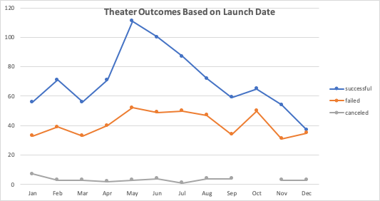
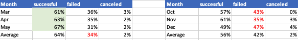
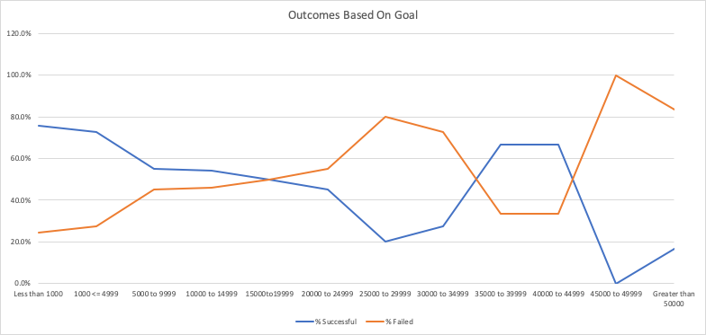
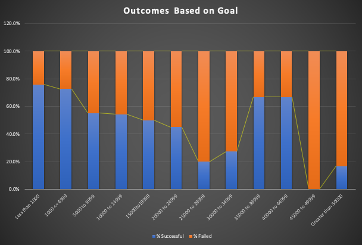

# Kickstarting with Excel

## Overview of Project

### Purpose: The purpose of this project was to help our Stakeholder understand the Kickstarter data. Most decision may not know the techincal aspect of trends. That is where we interject to analyze and visualize trends within the Data. The utlimate goal is to provide action insights to the stakeholders. 

## Analysis and Challenges

### Analysis of Outcomes Based on Launch Date  

 
   

The line graph above represnts outcomes based off launch date between the Years 2009-2017. The graph shows an upward trend between March and May. In march there  61% out outcomes were successful, April had 64% successful outcomes, and May had rate of success at 67%. The average failed outcome rate was about 34% from March-May. 
Conversely, October-December seem to be the months with lowest success rate. October had a success rate of 57%, November had a success rate of 61%, and December with success rate of 49%. Average failure ratio between October-Decmeber was higher at 42%. Please see table below to refernce outcome ratios.
. 
  

### Analysis of Outcomes Based on Goals  


The graph visualzies the relationshio between Outcomes and Goal amounts in different ranges. To anlalyze this data the first step was to find out the outcomes based on Goal amount, Outcomes and sub-catefory which in this case only plays. Countif statements were used to derive this data. The range for each bin was seperated by 5000 units/dollars. An example of a countif statemetn used is

```
 =COUNTIFS(Kickstarter!$D:$D,">=1000",Kickstarter!$D:$D,"<5000",Kickstarter!$F:$F,'Outcomes based on Goals'!L1,Kickstarter!$R:$R,"Plays")     
```

### Challenges and Difficulties Encountered
Some challenges include the manual input and lack of feedback from Excel. For example, is there is an error in the formula Excel is not able to pinpoint the error. Instead an error statement is populated. Also, a simple typo or misspelling can cause the data output to be incorrect so making sure the criteria matches the data or column script is essential. 


## Results!

- What are two conclusions you can draw about the Outcomes based on Launch Date?

In march there  61% out outcomes were successful, April had 64% successful outcomes, and May had rate of success at 67%. The average failed outcome rate was about 34% from March-May. 
Conversely, October-December seem to be the months with lowest success rate. October had a success rate of 57%, November had a success rate of 61%, and December with success rate of 49%. Average failure ratio between October-Decmeber was higher at 42%. Please see table below to refernce outcome ratios.

First conclusion: March - May has the highest chance of success as an outcome. The average success rate was the highest for these three months at 64%.

Second Conclusion: October-December is not the ideal time to starta campaign because the average failure rate was the highest at 42% 


- What can you conclude about the Outcomes based on Goals?

The top two success rates of 75.8% and 72.7% were when the goal was below $5000. The graph also illustrae as the goal increases the success rate decreased and failure rate increases. Although, there was a slght increase between the goal ranges ($35000-$45000). The success rate in this bin was 67% but the sample size was only 9 Projects. It is hard to make a justifable assertion from a small sample size but it may reqire more date mining. In Conlclusion, the maximixe the probability of success, the goal should be kept lower because there is a postive correlation between low goal amount and success rate.

- What are some limitations of this dataset?

One limiation is the sub category may not be granular enough to provide a complete actionable insight. Within plays there may be some genres which are more popular than other. Lacking this data is a limitation. 
Also, we are in 2020 so maybe the trends leading up to 2017 may have changed. Since the data is oudated we can assert the time frame is a limitation. 


- What are some other possible tables and/or graphs that we could create?

For the outcomes vs launch date I did like the line chart we used because the trend was easir to visualze.
However, for outcomes based on goals I would prefer to use a stacked column graph with one trend line. For me it is easier to see the trend by looking at one line. The bar graph I used is located below.

. 
